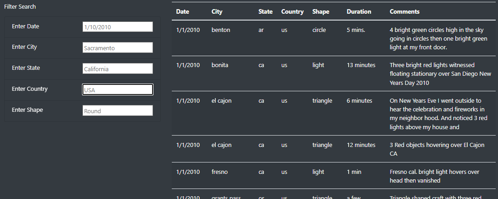

# UFO's

## Overview

We were tasked by the client to create a website with a dynamic table which updates itself upon the entry of several different filters. Our dataset consisted of over 100 observations of UFO sightings containing data regarding date, city, state, country, shape, duration, and commentary on the event. The dataset could be described as a list of key-value paired objects. Using Javascript, html, bootstrap, and CSS, we were able to construct a table that updates itself upon the entry of any of five filters. The selected filters were date, city, state, country, and shape. 
This was acheived through several html and javascript conventions. First, an html list was created to hold the filters themselves along with the value-entry text boxes.  Second, a Javascript function was created to detect any changes to the filter and log those changes to be applied to the newly filtered table. Third, we created a second Javascript function which would build a new data set iterating through each row of our underlying set and applying any newly detected filters to the data and place the newly filtered dataset into our table. 

## Results

The image above displays our site with the dynamic table but with no filters having been applied to our table. As is evident in the image, we are now able to filter our table by five categories; date, city, state, country, and shape. 

![filtered data](Resources/images/filtered.png
The image above displays our data edited to only show sightings in Oregon. Each time we enter a value for any and/or many filters, our table will automatically filter itself on the given parameters. 

## Summary
One drawback of this new design is that the filtering is updated each time a new value is entered which could be confusing to an end-user. One suggested change might be to re-introduce a button to apply the filters so that the user can be sure which filters are being applied to the table when it updates. A second element worthy of introduction would be to allow for the filter parameters to be agnostic to input issues such as capitalization and spelling.  As the site currently stands, each entry must be exact in order for their proper application. 
